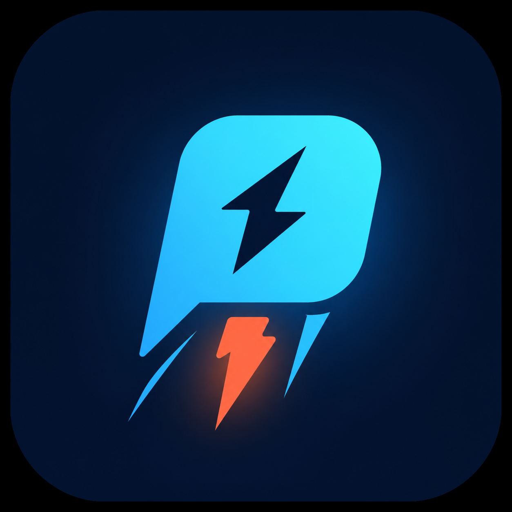
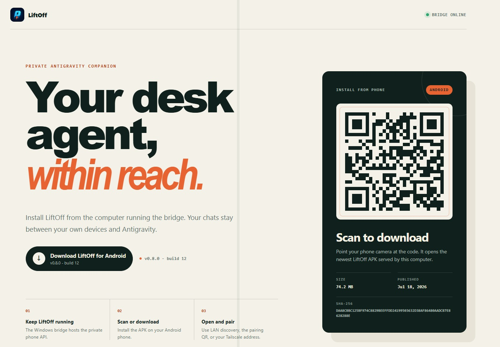
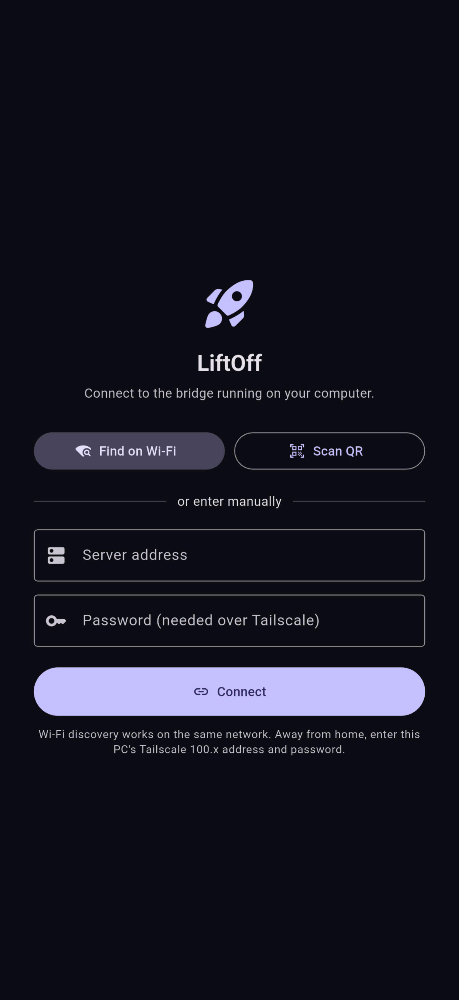
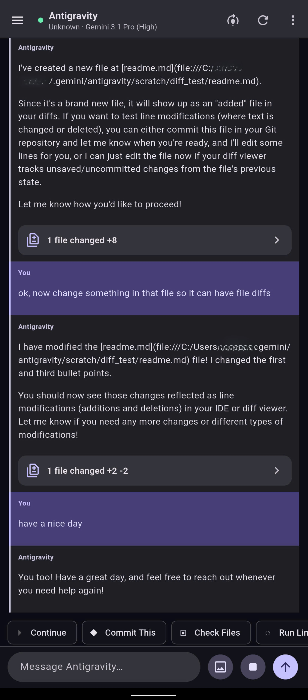
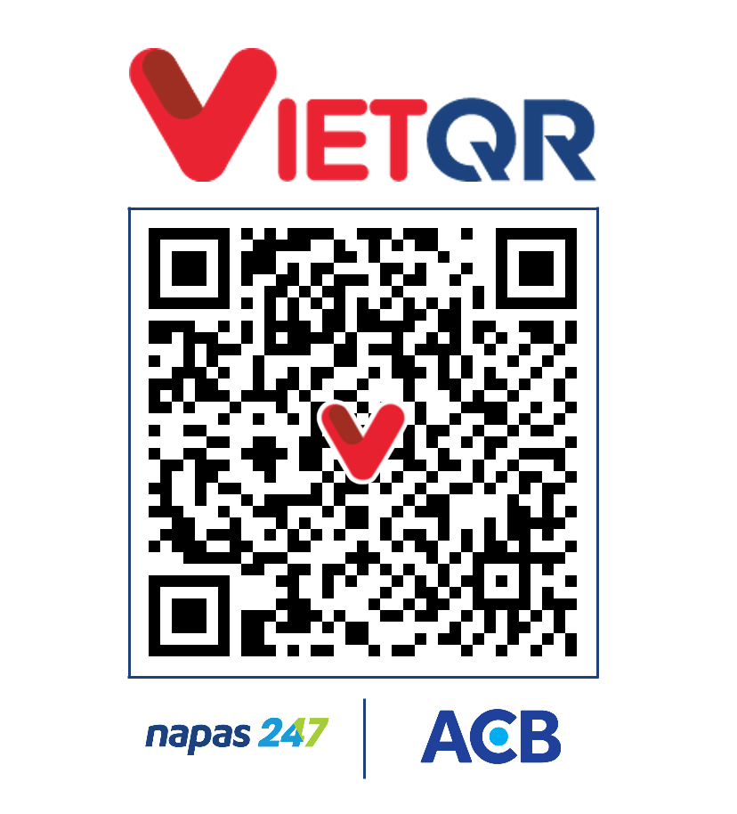

<div align="center">
  
  <h1>LiftOff</h1>
  <p><strong>Mang phiên Antigravity trên máy tính theo bạn lên điện thoại.</strong></p>
  <p>Một bridge riêng tư cho Windows và ứng dụng Android để nhắn tin, duyệt thay đổi, cấp quyền và điều khiển cuộc trò chuyện từ xa.</p>

  <p>
    <a href="README.md">English</a>
    &nbsp;|&nbsp;
    <a href="README.vi.md"><strong>Tiếng Việt</strong></a>
  </p>

  <p>
    <a href="https://github.com/creator4973/liftoff/releases"></a>
    <a href="https://github.com/creator4973/liftoff/actions/workflows/ci.yml"></a>
    
    <a href="LICENSE"></a>
  </p>
</div>

> [!IMPORTANT]
> LiftOff hiện là bản MVP thử nghiệm. RPC và giao diện nội bộ của Antigravity không phải API công khai ổn định, vì vậy một bản cập nhật Antigravity có thể khiến LiftOff cần cập nhật theo.

## Trợ lý trên máy tính, luôn trong tầm tay

LiftOff để bridge chạy ngay trên máy Windows của bạn, còn điện thoại Android đóng vai trò như một chiếc điều khiển gọn nhẹ. Ở nhà thì tìm máy qua Wi-Fi. Khi ra ngoài, bạn có thể kết nối bằng mạng Tailscale của chính mình. LiftOff không bắt bạn tạo thêm tài khoản đám mây riêng.

<p align="center">
  
</p>

<table>
  <tr>
    <td width="42%" align="center"></td>
    <td width="58%" align="center"></td>
  </tr>
  <tr>
    <td align="center"><strong>Kết nối qua Wi-Fi, mã QR hoặc Tailscale</strong></td>
    <td align="center"><strong>Đọc hội thoại và xem chi tiết tệp đã thay đổi</strong></td>
  </tr>
</table>

## Bạn có thể làm gì?

| Ngay trên điện thoại | Thiết kế cho kết nối riêng tư |
| --- | --- |
| Gửi tin nhắn và hình ảnh | Bridge chạy cục bộ trên Windows, có mật khẩu bảo vệ |
| Tạo, chuyển và dừng cuộc trò chuyện | Tự tìm máy trong Wi-Fi và ghép nối bằng QR |
| Chọn model đang có trong Antigravity | Dùng trực tiếp với Tailscale, không cần mở tunnel công khai |
| Nhận thông báo khi có câu trả lời hoặc yêu cầu cấp quyền | Cài đặt, bản chụp và thông tin đăng nhập được lưu trên thiết bị của bạn |
| Xem các tệp đã sửa và nội dung diff | Mã nguồn Node.js, Flutter và C# có thể tự kiểm tra |

Luồng RPC có cấu trúc hiện xử lý việc đọc hội thoại và các thao tác nhắn tin chính. Một lớp tương thích có kiểm soát vẫn dùng tự động hóa giao diện cho những chức năng chưa chuyển hoàn toàn sang RPC.

## Cài đặt

### Cài trên Windows

1. Mở trang [Releases mới nhất](https://github.com/creator4973/liftoff/releases).
2. Tải gói ZIP cho Windows và tệp APK cho Android.
3. Đối chiếu từng tệp với `SHA256SUMS.txt` trong cùng bản phát hành.
4. Giải nén gói Windows rồi mở `LiftOff.exe`.

Ứng dụng ở khay hệ thống sẽ tự cài thư viện Node.js khi cần và tự tạo các khóa
bảo mật cục bộ trong lần chạy đầu. Mật khẩu ghép nối chỉ hiện một lần để bạn lưu
vào trình quản lý mật khẩu.

Yêu cầu: Windows 10 trở lên, Node.js 22 trở lên, Antigravity đã đăng nhập và một điện thoại Android.

> [!NOTE]
> Cách cài một dòng kiểu WinGet sẽ được bổ sung khi LiftOff có gói Windows đã ký. Bản phát hành đầu tiên không yêu cầu người dùng chuyển thẳng một script PowerShell chưa ký từ Internet vào shell.

Nếu muốn tự cài thủ công, thiết lập HTTPS, build ứng dụng hoặc nâng cấp chi tiết, hãy xem [hướng dẫn cài đặt](docs/installation.md).

## LiftOff hoạt động như thế nào?

```text
Ứng dụng Android
       |
       | HTTPS và WebSocket trong mạng riêng của bạn
       v
LiftOff bridge trên Windows
       |
       | Antigravity RPC và lớp tương thích có kiểm soát
       v
Phiên Antigravity trên máy tính
```

- Cùng một Wi-Fi tin cậy: ứng dụng Android có thể tự tìm thấy bridge.
- Khi ở xa nhà: nhập địa chỉ Tailscale của máy tính cùng mật khẩu LiftOff.
- Khi Windows sleep hoặc hibernate, bridge cũng tạm dừng. Khóa màn hình vẫn dùng được với luồng nhắn tin qua RPC, nhưng còn phụ thuộc vào cách Windows và Antigravity hoạt động.

## Quyền riêng tư và bảo mật

LiftOff là công cụ điều khiển từ xa có quyền khá mạnh, vì vậy chỉ nên dùng trên thiết bị và mạng bạn tin tưởng.

- Trình cài đặt tạo tệp `.env` riêng ngay trên máy. Git sẽ bỏ qua tệp này.
- Khóa TLS, mật khẩu, log, tệp tải lên, ảnh chụp và dữ liệu lúc chạy không được đưa vào repository.
- Tunnel công khai chỉ là tùy chọn. Người dùng Tailscale không cần bật tunnel.
- Nên đọc phần [bảo mật](docs/security.md) và [quyền riêng tư](docs/privacy.md) trước khi cho phép truy cập từ bên ngoài mạng nhà.

## Tình trạng dự án

Các chức năng cốt lõi đã có thể dùng hằng ngày, nhưng đây vẫn là bản MVP thử nghiệm chứ chưa phải cam kết hỗ trợ ở mức sản phẩm thương mại. Bạn có thể xem [các giới hạn hiện tại](docs/support.md), [lịch sử cập nhật](CHANGELOG.md) và [danh sách issue](https://github.com/creator4973/liftoff/issues).

## Ủng hộ LiftOff

Nếu LiftOff giúp bạn đỡ phải chạy qua chạy lại giữa máy tính và điện thoại, bạn có thể mời mình một ly cà phê để tiếp sức cho dự án. Hoàn toàn tự nguyện, không ảnh hưởng đến tính năng hay mức độ hỗ trợ.

<table>
  <tr>
    <td width="50%" align="center"><strong>PayPal</strong></td>
    <td width="50%" align="center"><strong>VietQR</strong></td>
  </tr>
  <tr>
    <td align="center"></td>
    <td align="center"></td>
  </tr>
</table>

## Góp sức cho dự án

Bạn có thể báo lỗi, chia sẻ thông tin tương thích, sửa tài liệu hoặc gửi pull request gọn và rõ ràng. Hãy đọc [CONTRIBUTING.md](CONTRIBUTING.md) trước, và nhớ ghi phiên bản Antigravity khi báo lỗi tương thích.

## Tài liệu

- [Cài đặt và chạy lần đầu](docs/installation.md)
- [Kiến trúc và luồng dữ liệu](docs/architecture.md)
- [Ghép nối, truy cập mạng và bảo mật](docs/security.md)
- [Quyền riêng tư và dữ liệu cục bộ](docs/privacy.md)
- [Phát triển và kiểm thử](docs/development.md)
- [Giới hạn hiện tại và phạm vi hỗ trợ](docs/support.md)

## Giấy phép và ghi nhận

LiftOff được phát hành theo giấy phép GPL-3.0-only. Các thông báo bản quyền và giấy phép bắt buộc được ghi trong [NOTICE.md](NOTICE.md).
